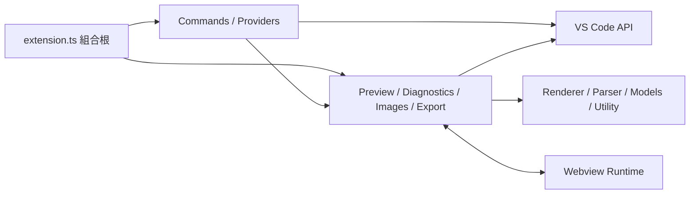

# AdocMD Forge Architecture

## 1. 文件目的

本文件定義 AdocMD Forge 的架構邊界、技術決策、資料流程、安全基準與測試策略。實作若調整公開命令、設定、資料模型或模組責任，必須同步更新本文件與使用者文件。

## 2. 產品範圍

AdocMD Forge 是 VS Code 文件工作台。0.0.1 可安裝版支援：

- AsciiDoc：`.adoc`、`.asciidoc`
- Markdown：`.md`
- Webview 即時預覽、雙向同步捲動與 VS Code 深色、淺色、高對比佈景主題
- 預覽相關的工作區與使用者層級設定
- 受信任工作區內的安全本機圖片、連結與 AsciiDoc include

下列功能屬於後續版本的目標架構，0.0.1 尚未宣稱支援：

- 文件標題 Outline 與點擊跳轉
- xref、anchor、Markdown 連結、圖片與 include 檢查
- 圖片拖放、貼上、複製與文件語法插入
- 一般 HTML、Standalone HTML 與 Embedded HTML 匯出
- AsciiDoc 語法完成、Hover 與語法說明

PDF、DOCX、多人協作、雲端儲存與自訂 Asciidoctor extension 不屬於目前規劃範圍。

## 3. 設計原則

1. `src/extension.ts` 只作為組合根，負責建立物件、注入依賴與註冊生命週期。
2. Renderer、Parser、Resolver 與 Export Transformer 儘量不依賴 `vscode`，以便在純 Node 環境進行單元測試。
3. Provider 與 Command Handler 只負責 VS Code API 轉接，不承擔文件解析或檔案命名規則。
4. 每一項非同步更新都帶有文件版本或 revision，較舊結果不得覆蓋較新狀態。
5. 所有 Event、Timer、Webview、DiagnosticCollection 與 OutputChannel 都必須可釋放。
6. Webview、文件內容、檔案路徑與訊息內容均採不信任預設。
7. 檔案操作使用 `vscode.workspace.fs` 與 `vscode.Uri`，避免只支援本機 Windows 路徑。
8. 發行內容由 bundle 與明確封裝清單控制，不把完整開發用 `node_modules` 放入 VSIX。

## 4. 相容性基準

| 項目 | 決策 | 原因 |
| --- | --- | --- |
| VS Code API | `^1.96.0` | 本機可實際執行 1.96.2 Extension Host，且所需 Webview、Diagnostics、Tree View 與 Document Drop API 已具備 |
| Extension Host | Node 20 相容語法與 API | VS Code 1.96 Extension Host 不等同開發機的 Node 24 CLI |
| TypeScript | 5.9.3 | 與 typescript-eslint 8.65.0 的官方相容範圍一致 |
| Markdown | markdown-it 14.3.0 | 成熟且具 token source map |
| AsciiDoc | `@asciidoctor/core` 3.0.4 + glob 13.0.6 override | Asciidoctor.js 4.0.6 README 要求 Node 24，無法支援目前 VS Code Extension Host；v3 runtime 只使用 glob 的 `sync()` API，以保留該 API 的安全版取代舊相依並加入 regression test |
| Bundle | esbuild | 縮小 VSIX、固定執行依賴並排除 `vscode` |
| 單元測試 | Vitest | 適合純 TypeScript 核心模組 |
| 整合測試 | 具型別測試清單 + `@vscode/test-electron` | 在真實 Extension Host 驗證 VS Code API 整合，且避免目前 Mocha 相依樹中尚無安全升級路徑的已知弱點 |

Renderer 對外一律回傳 `Promise`。這可統一 Markdown 與 AsciiDoc 呼叫流程，也保留日後升級非同步 Asciidoctor.js 的邊界。

## 5. 目錄與模組邊界

```text
src/
  extension.ts
  commands/
    commandRegistry.ts
    commandExecutor.ts
  preview/
    previewManager.ts
    previewPanel.ts
    previewHtmlFactory.ts
    previewMessage.ts
  renderer/
    documentRenderer.ts
    markdownRenderer.ts
    asciidocRenderer.ts
    htmlSanitizer.ts
  outline/
    outlineProvider.ts
    outlineParser.ts
  diagnostics/
    linkDiagnosticProvider.ts
    linkValidator.ts
    referenceParser.ts
  images/
    imageDropProvider.ts
    imageService.ts
    imageSyntax.ts
  export/
    exportService.ts
    exportHtmlBuilder.ts
  settings/
    extensionSettings.ts
  models/
    documentKind.ts
    documentAnalysis.ts
    renderedDocument.ts
  services/
    documentService.ts
    fileService.ts
  utility/
    asyncDebouncer.ts
    pathUtility.ts
    nonce.ts
  webview/
    preview.ts
test/
  unit/
  integration/
media/
dist/
scripts/
```

實際檔案只在功能需要時建立；不得預先放入空類別、空介面或未使用的抽象層。

## 6. 依賴方向



核心層不得匯入 `vscode`。若核心邏輯需要檔案內容或 URI 資訊，由應用層以明確資料型別傳入。

## 7. 文件分析模型

Renderer、Outline 與 Link Checker 共用一致的文件概念：

```ts
interface DocumentAnalysis {
  readonly kind: DocumentKind;
  readonly headings: readonly Heading[];
  readonly anchors: ReadonlySet<string>;
  readonly references: readonly DocumentReference[];
}
```

- Markdown 標題由 markdown-it token 解析，anchor 使用與常見 Markdown 標題連結一致的 slug 規則。
- AsciiDoc 標題、anchor 與來源位置由 Asciidoctor AST 取得。
- 需要精確 Diagnostic Range 的語法仍由 reference parser 對原始行內容定位，AST 用來驗證語意，不以不穩定的 HTML 反向推算位置。
- 每次分析結果綁定文件 URI 與版本；發布前再次比對版本。

## 8. 即時預覽

### 8.1 生命週期

- 每個來源文件最多對應一個 Preview Panel。
- 重複執行 Open Preview 會顯示既有 Panel。
- Panel dispose 後移除所有索引、訊息訂閱與更新排程。
- 不使用 `retainContextWhenHidden`；Webview 只透過 `getState`、`setState` 保存捲動位置。
- 文件關閉或 URI 變更時，不保留失效的 Document 參考。

### 8.2 更新流程

1. 文件變更事件進入可取消的 debounce。
2. 產生遞增 revision，Renderer 非同步產生已消毒內容。
3. 完成時比對文件版本與 revision。
4. Extension 透過具型別訊息更新 Webview 內容，不重設整份 `webview.html`。
5. Webview 回報已套用 revision，供測試與錯誤追蹤使用。

### 8.3 同步捲動

- Markdown 區塊使用 token `map` 加入 `data-source-line`。
- AsciiDoc 區塊使用 AST source location 加入 `data-source-line`。
- 編輯器可見範圍變更時，Extension 傳送來源行號。
- Webview 找出最近來源行標記並捲動。
- Webview 捲動時以節流訊息回傳最近來源行號，Extension 使用 `revealRange`。
- 雙方訊息包含 origin 與 sequence；套用遠端捲動期間抑制回傳，防止循環。

## 9. Webview 安全

每個 Panel 必須符合：

- `default-src 'none'`
- Script 使用外部 bundle、`webview.cspSource` 與每次建立的 nonce
- Style 只允許 `webview.cspSource`
- Image 只允許 `webview.cspSource`、`data:` 與明確需要的 `https:`
- 本機資源透過 `webview.asWebviewUri()`
- `localResourceRoots` 只包含 extension media 與目前文件所屬工作區
- `enableCommandUris` 維持關閉
- Markdown raw HTML 預設關閉
- AsciiDoc 與 Markdown 產出皆經 HTML sanitizer
- Webview message 使用 discriminated union，接收後執行 runtime validation
- 連結導向外部位置前檢查 scheme，只允許明確白名單

## 10. Outline

- 使用 `createTreeView()` 與 `TreeDataProvider`。
- TreeItem 具有由 URI、來源行與層級形成的穩定 ID。
- `getParent()` 支援 reveal 與展開狀態。
- 點擊項目只跳至對應文件與行號，不修改文件。
- Active Editor 或文件內容變更時，只更新受影響文件。
- 沒有可支援文件時顯示空狀態，不保留上一份文件的 Outline。

## 11. Link Checker

單一 `DiagnosticCollection` 名稱為 `adocmd-forge`。每個 URI 使用 `set()` 原子替換，不因單一文件更新而全域 `clear()`。

檢查範圍：

- AsciiDoc `xref:` 與 `<<...>>`
- AsciiDoc explicit anchor 與自動標題 anchor
- Markdown inline link、reference link 與 fragment
- Markdown 與 AsciiDoc 圖片
- AsciiDoc include

驗證規則：

1. `http`、`https`、`mailto` 等外部 URI 不做網路存活探測，只驗證語法與允許的 scheme。
2. 本機或工作區 URI 必須存在，且不可經由 `..` 逃出允許的工作區根目錄。
3. Fragment 指向目前文件或可讀取的目標文件時，必須存在於該文件的 anchor 集合。
4. 動態屬性無法安全解析時，不臆測目標；以可辨識的資訊層級 Diagnostic 說明限制。
5. Diagnostic 必須具有精確 Range、`source`、穩定 `code` 與適當 severity。
6. 文件關閉時刪除該 URI 結果，Extension 停用時 dispose。

## 12. 圖片流程

拖放與 Copy Image 命令共用 `ImageService`：

1. 取得來源 URI 或 `DataTransferFile` bytes。
2. 驗證 MIME、附檔名、大小與文件是否可寫入。
3. 依工作區設定解析圖片目錄。
4. 驗證目的 URI 位於允許根目錄。
5. 若同名內容不同，使用穩定的 `name-2.ext` 命名；不靜默覆寫。
6. 完成寫入後才建立文字編輯。
7. AsciiDoc 插入 `image::path[]`，Markdown 插入 ``。
8. 寫入失敗時不插入語法，並清楚回報錯誤。

圖片複製與文字插入不宣稱是單一檔案系統交易；整合測試必須驗證失敗時不會留下錯誤的文件語法。

## 13. HTML 匯出定義

| 模式 | 輸出 |
| --- | --- |
| HTML | 完整 HTML5 文件；CSS 內嵌，圖片與連結保留可攜的相對路徑 |
| Standalone HTML | 完整 HTML5 文件；CSS 與可讀取的本機圖片轉為 data URI，不依賴旁邊資源 |
| Embedded HTML | 經消毒的語意化 body fragment，不包含 `html`、`head`、`body` 外框 |

所有模式共用 Renderer 與 Sanitizer。輸出路徑由使用者選擇或依設定產生；既有檔案必須經過確認，不靜默覆寫。

## 14. 設定

所有設定放在 `adocmdForge` namespace，並透過單一 `ExtensionSettings` 讀取。不得在功能模組散落 magic string。

設定必須：

- 同時支援 User 與 Workspace scope。
- 在 manifest 中提供預設值、型別、限制與清楚說明。
- 設定變更時只重建受影響服務。
- 涉及路徑的值在使用時再次驗證，不信任 manifest schema 即已足夠。
- 無法在執行期間真正生效的選項不得公開。

## 15. 錯誤處理與紀錄

- Command 經由統一 executor 執行，將未知錯誤正規化並寫入 OutputChannel。
- 使用者可處理的錯誤以 VS Code notification 顯示簡潔訊息。
- `CancellationError` 不顯示為失敗。
- 所有 fire-and-forget Promise 都必須附帶錯誤處理。
- 不使用 `console.log`、`console.error` 作為正式執行期紀錄。
- 不記錄文件全文、圖片內容或可能含機密的 URI query。

## 16. 效能與記憶體

- 預覽與 Diagnostics 使用 debounce 並取消過期工作。
- 大型文件不得在每次按鍵時重建不相關的全工作區索引。
- Panel 隱藏時不保留第二份 DOM runtime。
- Webview 訊息不傳送重複 base64 圖片內容。
- Event listener、Timer、CancellationTokenSource 與 Provider registration 都納入 Disposable。
- 整合測試重複開關 Preview，確認 listener 與 Panel 數量回到基準。

## 17. 測試策略

### 17.1 單元測試

- Markdown 與 AsciiDoc renderer
- heading、anchor、reference parser
- link resolver 與路徑防護
- 圖片命名與語法
- HTML sanitizer 與三種 export builder
- message validator、debouncer 與錯誤正規化

### 17.2 Extension Host 整合測試

- Extension activation 與命令註冊
- Preview 建立、重新使用、更新與釋放
- Tree View 資料與跳轉
- Diagnostic 發布、更新與刪除
- Document Drop Provider 與 Copy Image
- Export 寫檔
- 設定變更

### 17.3 發行前品質關卡

1. TypeScript typecheck
2. ESLint
3. 單元測試與 coverage
4. Extension Host 整合測試
5. Production bundle
6. `vsce ls` 封裝內容檢查
7. VSIX package
8. VSIX 安裝 smoke test
9. 已安裝 Extension Host smoke test
10. Webview Developer Tools 無 Console Error

## 18. 參考專案

參考專案只用於分析設計取捨，不直接複製程式碼。

| 路徑 | 狀態 | 用途 |
| --- | --- | --- |
| `D:\Project\legacy-javascript-toolkit\legacy-javascript-toolkit` | 已分析 | 借鏡 composition root、建構式注入、Disposable、debounce、多根工作區與安全寫入；不沿用扁平結構、全域啟用與薄弱測試流程 |
| Reference Project Path 1 | 保留欄位，未提供本機路徑 | 後續由專案維護者補充 |
| Reference Project Path 2 | 保留欄位，未提供本機路徑 | 後續由專案維護者補充 |
| Reference Project Path 3 | 保留欄位，未提供本機路徑 | 後續由專案維護者補充 |

新增參考專案時，應記錄其可驗證優點、限制與採納決策，不以複製來源碼取代架構設計。

## 19. 發行與版本

- 0.0.1 採 MIT License，Publisher 依目前 Git origin 與既有參考專案使用 `BucketHsu`。
- `package.json`、lockfile、README、CHANGELOG、Git tag 與 VSIX 檔名必須使用相同版本。
- CI 使用 `npm ci`，不得以未鎖定依賴產出正式 VSIX。
- VSIX 必須保留必要第三方授權資訊，不以 `.vscodeignore` 排除授權檔。
- Marketplace icon 使用 PNG，不使用 SVG。
- 自動發行憑證不得寫入 repository 或 VSIX。
