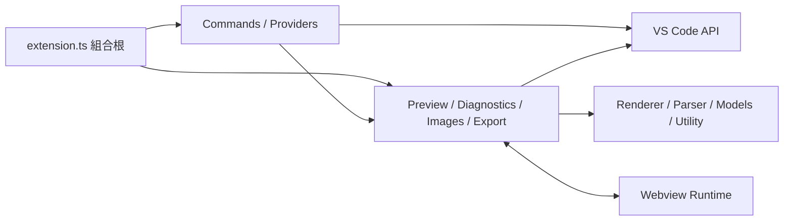

# AdocMD Forge Architecture

## 1. 文件目的

本文件定義 AdocMD Forge 的架構邊界、技術決策、資料流程、安全基準與測試策略。實作若調整公開命令、設定、資料模型或模組責任，必須同步更新本文件與使用者文件。

## 2. 產品範圍

AdocMD Forge 是 VS Code 文件工作台，目前支援：

- AsciiDoc：`.adoc`、`.asciidoc`
- Markdown：`.md`
- Webview 即時預覽、目前來源區塊標示、雙向同步捲動與 VS Code 深色、淺色、高對比佈景主題
- 預覽相關的工作區與使用者層級設定
- 受信任工作區內的安全本機圖片、連結與 AsciiDoc include
- AsciiDoc TextMate 語法醒目提示、Snippet、快捷鍵、語法補全、Hover 與繁體中文語法說明
- 受信任工作區內的圖片拖曳、圖片貼上與 `Copy Image` 檔案選取流程
- 目前 active editor 的 AsciiDoc／Markdown Outline、標題階層與點擊跳轉；AsciiDoc 另提供原生 Document Symbol 與 Folding Range
- 受信任工作區內的 AsciiDoc 文件／anchor 索引、路徑與 anchor 補全、Definition、Document Link、References 與明確 anchor 安全 Rename
- 目前 active editor 的 AsciiDoc／Markdown 本機引用檢查與 Problems Diagnostic；AsciiDoc 缺漏路徑與 anchor 提供 Quick Fix
- HTML、Standalone HTML 與 Embedded HTML 匯出；三種模式共用 Renderer 與 Sanitizer
- AsciiDoc 的本機 `asciidoctor-pdf` PDF 匯出命令整合

發行關卡由自動化測試、Extension Host 整合測試、VSIX 白名單檢查與隔離安裝驗證；實際上架 Marketplace 仍需 Publisher 憑證與上架操作。

DOCX、多人協作、雲端儲存與自訂 Asciidoctor extension 不屬於目前規劃範圍。

## 3. 設計原則

1. `src/extension.ts` 只作為組合根，負責建立物件、注入依賴與註冊生命週期。
2. Renderer、Parser、Resolver 與 Export Transformer 儘量不依賴 `vscode`，以便在純 Node 環境進行單元測試。
3. Provider 與 Command Handler 只負責 VS Code API 轉接，不承擔文件解析或檔案命名規則。
4. 每一項非同步更新都帶有文件版本或 revision，較舊結果不得覆蓋較新狀態。
5. 所有 Event、Timer、Webview、DiagnosticCollection 與 OutputChannel 都必須可釋放。
6. Webview、文件內容、檔案路徑與訊息內容均採不信任預設。
7. 檔案操作使用 `vscode.workspace.fs` 與 `vscode.Uri`，避免只支援本機 Windows 路徑。
8. 發行內容由 bundle 與明確封裝清單控制，不把完整開發用 `node_modules` 放入 VSIX。

## 4. 相容性基準

| 項目 | 決策 | 原因 |
| --- | --- | --- |
| VS Code API | `^1.97.0` | `DocumentPasteEditProvider` 由 1.97 以上提供，且所需 Webview、Diagnostics、Tree View 與 Document Drop API 已具備 |
| Extension Host | Node 20 相容語法與 API | VS Code 1.97 Extension Host 不等同開發機的 Node 24 CLI |
| TypeScript | 5.9.3 | 與 typescript-eslint 8.65.0 的官方相容範圍一致 |
| Markdown | markdown-it 14.3.0 | 成熟且具 token source map |
| AsciiDoc | `@asciidoctor/core` 3.0.4 + glob 13.0.6 override | Asciidoctor.js 4.0.6 README 要求 Node 24，無法支援目前 VS Code Extension Host；v3 runtime 只使用 glob 的 `sync()` API，以保留該 API 的安全版取代舊相依並加入 regression test |
| Bundle | esbuild | 縮小 VSIX、固定執行依賴並排除 `vscode` |
| 單元測試 | Vitest | 適合純 TypeScript 核心模組 |
| 整合測試 | 具型別測試清單 + `@vscode/test-electron` | 在真實 Extension Host 驗證 VS Code API 整合，且避免目前 Mocha 相依樹中尚無安全升級路徑的已知弱點 |

Renderer 對外一律回傳 `Promise`。這可統一 Markdown 與 AsciiDoc 呼叫流程，也保留日後升級非同步 Asciidoctor.js 的邊界。

## 5. 目錄與模組邊界

```text
src/
  extension.ts
  commands/
    commandRegistry.ts
    commandExecutor.ts
    registerLanguageCommands.ts
  preview/
    previewManager.ts
    previewPanel.ts
    previewHtmlFactory.ts
    previewMessage.ts
  renderer/
    documentRenderer.ts
    markdownRenderer.ts
    asciidocRenderer.ts
    htmlSanitizer.ts
  outline/
    outlineProvider.ts
    outlineParser.ts
    documentStructure.ts
    asciidocDocumentProvider.ts
  diagnostics/
    linkDiagnosticProvider.ts
    linkValidator.ts
    referenceParser.ts
  images/
    imageDropProvider.ts
    imageService.ts
    imageSyntax.ts
  export/
    exportService.ts
    exportHtmlBuilder.ts
  settings/
    extensionSettings.ts
  language/
    asciidocAttributes.ts
    asciidocReferenceContext.ts
    asciidocWorkspaceProviders.ts
    asciidocSyntax.ts
    asciidocCompletion.ts
    asciidocCompletionProvider.ts
    asciidocHover.ts
    asciidocHoverProvider.ts
    asciidocSyntaxGuide.ts
    linkQuickFix.ts
    registerAsciiDocLanguage.ts
    workspaceDocumentIndex.ts
    workspaceLanguageService.ts
  models/
    documentKind.ts
    documentAnalysis.ts
    renderedDocument.ts
  services/
    documentService.ts
    fileService.ts
  utility/
    asyncDebouncer.ts
    pathUtility.ts
    nonce.ts
  webview/
    preview.ts
test/
  unit/
  integration/
media/
dist/
scripts/
```

實際檔案只在功能需要時建立；不得預先放入空類別、空介面或未使用的抽象層。

## 6. 依賴方向



核心層不得匯入 `vscode`。若核心邏輯需要檔案內容或 URI 資訊，由應用層以明確資料型別傳入。

## 7. 文件分析模型

Renderer、Outline 與 Link Checker 共用一致的文件概念：

```ts
interface DocumentAnalysis {
  readonly documentUri: string;
  readonly version: number;
  readonly kind: DocumentKind;
  readonly headings: readonly Heading[];
  readonly outline: readonly OutlineNode[];
  readonly anchors: ReadonlySet<string>;
  readonly references: readonly DocumentReference[];
}
```

- `Heading` 保留 `documentUri`、`title`、`level`、零起算 `sourceLine`、`DocumentRange` 與穩定 `id`；`OutlineNode` 另提供不可變的 `children`。
- Markdown 標題由 markdown-it token 解析，支援 ATX 與 Setext；token map 提供來源 Range，anchor 使用 slug 規則。程式碼區塊不會進入 heading token。
- AsciiDoc 文件標題與章節由 Asciidoctor AST 取得，不以正規表示式掃描章節；source block 中的標題樣式不會被誤判。
- 標題節點 ID 由文件 URI、來源行與層級產生，同一份文件與相同來源位置可重現。
- 需要精確 Diagnostic Range 的語法仍由 reference parser 對原始行內容定位，AST 用來驗證語意，不以不穩定的 HTML 反向推算位置。
- 每次分析結果綁定文件 URI 與版本；發布前再次比對版本。

## 8. 即時預覽

### 8.1 生命週期

- 每個來源文件最多對應一個 Preview Panel。
- 重複執行 Open Preview 會顯示既有 Panel。
- Panel dispose 後移除所有索引、訊息訂閱與更新排程。
- 不使用 `retainContextWhenHidden`；Webview 只透過 `getState`、`setState` 保存捲動位置。
- 文件關閉或 URI 變更時，不保留失效的 Document 參考。

### 8.2 更新流程

1. 文件變更事件進入可取消的 debounce。
2. 產生遞增 revision，Renderer 非同步產生已消毒內容。
3. 完成時比對文件版本與 revision。
4. 受信任 AsciiDoc 使用單次 render 的 IncludeProcessor registry；`SecureIncludeResolver` 以 workspace root、source directory 與 realpath 邊界解析 `include::`，不讓 Asciidoctor 預設檔案讀取繞過安全政策。
5. Include Processor 對巢狀 include 維持 canonical ancestor 與最大深度，並套用 `lines`、`tag`／`tags` 選取；缺檔、循環、路徑拒絕與 tag 問題轉成 renderer message。
6. AsciiDoc renderer 解析已儲存文件的 `:stylesheet:`／`:stylesdir:`，只傳遞候選本機 CSS 路徑；include 權限仍獨立受工作區信任狀態控制。
7. Extension Host 以 workspace root、realpath、檔案類型與 Webview URI 邊界再次驗證 stylesheet，再透過具型別訊息更新 Webview 內容；未受信任工作區也只允許此範圍內的 CSS。
8. 工作區索引監看已引用的文件、CSS、圖片與 include；相依資源異動時，以 debounce 重新檢查 active document 並重新渲染相關 Preview。
9. Webview 以文件專用 `<link rel="stylesheet">` 管理樣式生命週期，不重設整份 `webview.html`，並在下一次 revision 或 dispose 時移除舊連結。
10. Webview 回報已套用 revision，供測試與錯誤追蹤使用。

### 8.3 同步捲動

- Markdown 區塊使用 token `map` 加入 `data-source-line`。
- AsciiDoc 區塊使用 AST source location 加入 `data-source-line`。
- 編輯器游標／選取位置變更時，Extension 傳送目前游標行；首次開啟與重新渲染後也以游標行定位。
- 編輯器只有捲動畫面而未移動游標時，仍由可見範圍事件傳送畫面頂端來源行。
- Webview 找出最近來源行標記並捲動，同時只標示該來源區塊；章節節點只標示直接標題，不將整章內容套上醒目樣式。
- Webview 捲動時以節流訊息回傳最近來源行號，Extension 使用 `revealRange`。
- 訊息方向區分來源端，並以 sequence 配對往返；套用程式化捲動期間抑制回傳，防止循環。

## 9. Webview 安全

每個 Panel 必須符合：

- `default-src 'none'`
- Script 使用外部 bundle、`webview.cspSource` 與每次建立的 nonce
- Style 只允許 `webview.cspSource`
- Image 只允許 `webview.cspSource`、`data:` 與明確需要的 `https:`
- 本機資源透過 `webview.asWebviewUri()`
- `localResourceRoots` 只包含 extension media 與目前文件所屬工作區
- `enableCommandUris` 維持關閉
- Markdown raw HTML 預設關閉
- AsciiDoc 與 Markdown 產出皆經 HTML sanitizer
- Webview message 使用 discriminated union，接收後執行 runtime validation
- 連結導向外部位置前檢查 scheme，只允許明確白名單

## 10. AsciiDoc 語法輔助

語法輔助由 TextMate grammar、Snippet、靜態語法目錄、純 TypeScript 核心與 VS Code adapter 組成：

- `syntaxes/asciidoc.tmLanguage.json` 提供不依賴 Extension 啟動的 AsciiDoc 語法醒目提示；raw／literal block 必須優先於一般行內語法，避免錯誤著色。
- `snippets/asciidoc.json` 提供常用文件結構與巨集，manifest 快捷鍵只在 AsciiDoc 編輯器有文字焦點時生效。
- `asciidocSyntax.ts` 集中保存標題、段落、文字樣式、清單、區塊、連結、資源與屬性的說明、範例及 Snippet。
- `asciidocCompletion.ts` 只依游標前綴判斷已知語法情境；一般段落文字不回傳補全，避免干擾正常撰寫。
- `asciidocHover.ts` 以來源行文字與游標位置辨識語法，回傳穩定 Range 與繁體中文 Markdown 說明。
- VS Code provider 只註冊 `file` 與 `untitled` 的 `asciidoc` 語言，不註冊 Markdown。
- `AsciiDocDocumentProvider` 共用 `documentStructure.ts` 的純資料結構，提供 Document Symbol、Breadcrumbs、Go to Symbol 與 Folding Range。
- `Open AsciiDoc Syntax Guide` 以 untitled AsciiDoc 文件開啟內建說明，內容與語法目錄保持同一版本。

Provider 不負責解析完整文件或執行檔案操作；語法目錄與核心函式可在純 Node 單元測試，VS Code adapter 則由 Extension Host 整合測試驗證。

### 10.1 工作區語意導覽

- `WorkspaceDocumentIndex` 不依賴 VS Code API，保存 AsciiDoc／Markdown 文件分析、明確 anchor、自動標題 anchor 與引用；Completion、Definition、Document Link、References、Rename 與 Quick Fix 共用同一份結果。
- `WorkspaceLanguageService` 是 VS Code 檔案系統 adapter，只在受信任工作區建立索引；初始掃描與後續檔案事件都排除 Git、相依套件、建置產物與測試下載目錄，且共用 10,000 個資源的硬上限。
- 初始索引以小批次讀取，文件變更以 debounce 更新；workspace folder、信任狀態與 FileSystemWatcher 事件使用 generation 防止過期非同步結果回寫。
- xref 補全可列出目前或目標文件的明確及自動 anchor；include 與圖片補全使用相對路徑，圖片另依靜態 `:imagesdir:` 調整基準目錄。
- Definition 與 Document Link 可開啟本機文件或 anchor；References 會尋找工作區內指向同一目標 anchor 的引用。
- Rename 只允許明確宣告的 anchor，先驗證名稱與同文件碰撞，再以單一 `WorkspaceEdit` 更新定義及 AsciiDoc／Markdown 跨文件引用；自動標題 anchor 必須先改為明確 anchor。
- Code Action 只處理 `adocmd-forge` 的 `missing-file` 與 `missing-anchor` Diagnostic，依路徑或 anchor 相似度提供最多五個 Quick Fix，不自動套用猜測結果。
- EventEmitter、FileSystemWatcher、Timer、索引與非同步 generation 均由 service 統一管理及釋放。

### 10.2 編輯器浮動格式面板與版面

- `registerFormattingCommands` 將粗體、斜體、注目、等寬、刪除線、上標與下標映射至 AsciiDoc／Markdown 對應標記。
- 純函式 `textFormattingCore` 先以文件 offset 計算多游標結果，再由 VS Code adapter 一次套用編輯並恢復選取範圍。
- `PreviewManager.setLayout` 管理 source、split、preview 三種版面；source 模式釋放 Preview Panel，split／preview 模式只改變 Panel 所在欄位。
- 編輯器格式命令透過 Quick Pick 浮動格式面板與 `menus.editor/context` 提供；不在 `menus.editor/title` 常駐七個格式按鈕，選取文字時包覆內容，沒有選取文字時插入成對標記。
- Preview Webview 只負責呈現文件與同步捲動，不建立操作工具列；預覽版面、重新整理、語法說明與 HTML／PDF 操作也由來源編輯器的 `menus.editor/title` 提供。
- `editor/title` 與 `view/title` 命令一律宣告 Codicon；`title` 僅作為滑鼠提示與命令面板文字，避免標題列使用文字按鈕。
- 匯出命令辨識 `editor/title` 自動傳入的來源文件 URI，不將它誤作目的地；非來源副檔名的 URI 仍可供整合測試與自動化指定輸出位置。
- Windows PDF runner 使用 `where.exe` 找出 RubyGems wrapper 與同目錄 `ruby.exe`，再直接執行無副檔名的 gem 腳本；不使用 `shell: true`，避免文件路徑或自訂參數進入 shell 解譯。
- PDF runner 的 `cwd` 固定為來源文件目錄，使相對 PDF theme／font path 與一般從文件目錄執行 `asciidoctor-pdf` 的行為一致；workspace root 只用於安全邊界與 `{workspace}` 參數。
- 格式命令由來源編輯器執行，不再依賴 Preview Panel 取得或恢復文字選取範圍。
- 所有工具列命令仍走 `CommandExecutor`，錯誤寫入 Output Channel 並顯示可理解的通知。

### 10.3 外部 Asciidoctor PDF

- HTML／Embedded／Standalone 匯出繼續使用內建 renderer；PDF 使用外部 `asciidoctor-pdf`，避免將 Ruby runtime、PDF converter、字型或 diagram extension 打包進 VSIX。
- CLI 只以 `spawn`、參數陣列與工作區 cwd 執行，不經 shell；來源與目的地先通過 workspace path policy。
- `asciidoctorPdfArguments` 支援 `{source}`、`{destination}`、`{workspace}` 佔位符，讓使用者自行加入 `-r asciidoctor-diagram`、`-a data-uri`、theme 與字型設定。

## 11. Outline

- 使用 `createTreeView()` 與 `TreeDataProvider`。
- `OutlineProvider` 只維護目前 active editor；沒有可支援文件時清除上一份文件的節點並顯示空狀態。
- AsciiDoc 使用 Asciidoctor AST，Markdown 使用 markdown-it token；不以單純正規表示式取代 parser。
- TreeItem 具有由 URI、來源行與層級形成的穩定 ID。
- `getParent()` 支援 reveal 與展開狀態。
- 點擊項目只跳至對應文件與行號，不修改文件。
- Active Editor 或文件內容變更時，只更新目前文件；文件修改由 `adocmdForge.outline.updateDelay` debounce。
- TreeView、事件、debounce timer 與跳轉 command 均納入 Extension context 的 Disposable 生命週期。
- Explorer 不建立全工作區多文件樹；工作區語意索引獨立提供跨文件補全、導覽、References 與 Rename。Link Checker 仍只發布目前 active editor 的 Diagnostic。

## 12. Link Checker

單一 `DiagnosticCollection` 名稱為 `adocmd-forge`。每個 URI 使用 `set()` 原子替換，不因單一文件更新而全域 `clear()`。

檢查範圍：

- AsciiDoc `link:`、`xref:` 與 `<<...>>`
- AsciiDoc explicit anchor 與自動標題 anchor
- Markdown inline link 與 fragment
- Markdown 與 AsciiDoc `image:`／`image::` 圖片
- AsciiDoc include

驗證規則：

1. `http`、`https`、`mailto` 等外部 URI 不做網路存活探測，只驗證語法與允許的 scheme。
2. 本機或工作區 URI 必須存在，且不可經由 `..` 逃出允許的工作區根目錄。
3. Fragment 指向目前文件或可讀取的目標文件時，必須存在於該文件的 anchor 集合。
4. AsciiDoc 圖片路徑以文件目錄加上靜態 `:imagesdir:` 作為解析基準；動態、遠端或絕對屬性不會被推算。
5. 動態屬性無法安全解析時，不臆測目標，也不讀取推算出的路徑。
6. Diagnostic 必須具有精確 Range、`source`、穩定 `code` 與適當 severity，讓 AsciiDoc Code Action 可提供缺漏路徑或 anchor 的候選修正。
7. 相依資源變更時重新檢查目前 active editor；文件關閉時刪除該 URI 結果，Extension 停用時 dispose。

## 13. 圖片流程

拖放、貼上與 Copy Image 命令共用 `ImageService`、`ImagePathPolicy` 與 `ImageSyntaxBuilder`：

1. 取得來源 URI 或 `DataTransferFile` bytes。
2. 驗證 MIME、附檔名、大小與文件是否可寫入。
3. 依工作區設定解析圖片目錄。
4. 驗證目的 URI 位於允許根目錄。
5. 若同名內容不同，使用穩定的 `name-2.ext` 命名；不靜默覆寫。
6. 完成寫入後才建立文字編輯。
7. AsciiDoc 插入 `image::path[]`，Markdown 插入 ``。
8. 寫入失敗時不插入語法，並清楚回報錯誤。

VS Code 1.97 以上另註冊 `DocumentPasteEditProvider`，接收 `image/*`、`files` 與 `text/uri-list` DataTransfer。Provider 使用與拖放相同的來源解析、檔名清理、重名防護、工作區路徑驗證與語法生成規則。若作業系統或 VS Code 沒有將二進位剪貼簿資料放入 DataTransfer，API 不會提供可讀取的圖片 bytes；此時由 `Copy Image` 指令提供檔案選取替代流程。

圖片複製與文字插入不宣稱是單一檔案系統交易；整合測試必須驗證失敗時不會留下錯誤的文件語法。

## 14. HTML 匯出定義

| 模式 | 輸出 |
| --- | --- |
| HTML | 完整 HTML5 文件；CSS 內嵌，圖片與連結保留可攜的相對路徑 |
| Standalone HTML | 完整 HTML5 文件；CSS 與可讀取的本機圖片轉為 data URI，不依賴旁邊資源 |
| Embedded HTML | 經消毒的語意化 body fragment，不包含 `html`、`head`、`body` 外框 |

所有模式共用 Renderer 與 Sanitizer。輸出路徑由使用者選擇或依設定產生；既有檔案必須經過確認，不靜默覆寫。

## 15. 設定

所有設定放在 `adocmdForge` namespace，並透過單一 `ExtensionSettings` 讀取。不得在功能模組散落 magic string。

設定必須：

- 同時支援 User 與 Workspace scope。
- 在 manifest 中提供預設值、型別、限制與清楚說明。
- 設定變更時只重建受影響服務。
- 涉及路徑的值在使用時再次驗證，不信任 manifest schema 即已足夠。
- 無法在執行期間真正生效的選項不得公開。

目前公開設定：

- `adocmdForge.outline.updateDelay`：預設 150 毫秒，範圍 50 至 2000 毫秒。
- `adocmdForge.diagnostics.updateDelay`：預設 150 毫秒，範圍 50 至 2000 毫秒；Diagnostics 會在設定的延遲後重新檢查目前文件。

HTML 匯出不新增公開設定；目的地一律由儲存對話框或命令傳入 URI 指定。

## 16. 錯誤處理與紀錄

- Command 經由統一 executor 執行，將未知錯誤正規化並寫入 OutputChannel。
- 使用者可處理的錯誤以 VS Code notification 顯示簡潔訊息。
- `CancellationError` 不顯示為失敗。
- 所有 fire-and-forget Promise 都必須附帶錯誤處理。
- 不使用 `console.log`、`console.error` 作為正式執行期紀錄。
- 不記錄文件全文、圖片內容或可能含機密的 URI query。

## 17. 效能與記憶體

- 預覽與 Diagnostics 使用 debounce 並取消過期工作。
- 大型文件不得在每次按鍵時重建不相關的全工作區索引。
- Panel 隱藏時不保留第二份 DOM runtime。
- Webview 訊息不傳送重複 base64 圖片內容。
- Event listener、Timer、CancellationTokenSource 與 Provider registration 都納入 Disposable。
- 整合測試重複開關 Preview，確認 listener 與 Panel 數量回到基準。

## 18. 測試策略

### 17.1 單元測試

- Markdown 與 AsciiDoc renderer
- heading、anchor、reference parser
- link resolver 與路徑防護
- 圖片命名與語法
- HTML sanitizer 與三種 export builder
- AsciiDoc 語法目錄、補全情境、Hover 範圍與語法說明內容
- message validator、debouncer 與錯誤正規化

### 17.2 Extension Host 整合測試

- Extension activation 與命令註冊
- Preview 建立、重新使用、更新與釋放
- Tree View 資料與跳轉
- Diagnostic 發布、更新與刪除
- Document Drop Provider 與 Copy Image
- Export 寫檔
- 設定變更

### 17.3 發行前品質關卡

1. TypeScript typecheck
2. ESLint
3. 單元測試與 coverage
4. Extension Host 整合測試
5. Production bundle
6. `vsce ls` 封裝內容檢查
7. VSIX package
8. VSIX 安裝 smoke test
9. 已安裝 Extension Host smoke test
10. Webview Developer Tools 無 Console Error

## 19. 參考專案

參考專案只用於分析設計取捨，不直接複製程式碼。

| 路徑 | 狀態 | 用途 |
| --- | --- | --- |
| `D:\Project\legacy-javascript-toolkit\legacy-javascript-toolkit` | 已分析 | 借鏡 composition root、建構式注入、Disposable、debounce、多根工作區與安全寫入；不沿用扁平結構、全域啟用與薄弱測試流程 |
| Reference Project Path 1 | 保留欄位，未提供本機路徑 | 後續由專案維護者補充 |
| Reference Project Path 2 | 保留欄位，未提供本機路徑 | 後續由專案維護者補充 |
| Reference Project Path 3 | 保留欄位，未提供本機路徑 | 後續由專案維護者補充 |

新增參考專案時，應記錄其可驗證優點、限制與採納決策，不以複製來源碼取代架構設計。

## 20. 發行與版本

- 專案採 MIT License，Publisher 為 `BucketHsu`。
- `package.json`、lockfile、CHANGELOG、Git tag 與 VSIX 檔名必須使用相同版本；Marketplace README 不寫死版本號。
- CI 使用 `npm ci`，不得以未鎖定依賴產出正式 VSIX。
- VSIX 只封裝明確白名單內的執行檔與公開 Marketplace 文件，不封裝內部架構、開發指南或 README 的 AsciiDoc 來源。
- VSIX 必須保留必要第三方授權資訊，不以 `.vscodeignore` 排除授權檔。
- Marketplace icon 使用 PNG，不使用 SVG。
- 自動發行憑證不得寫入 repository 或 VSIX。
